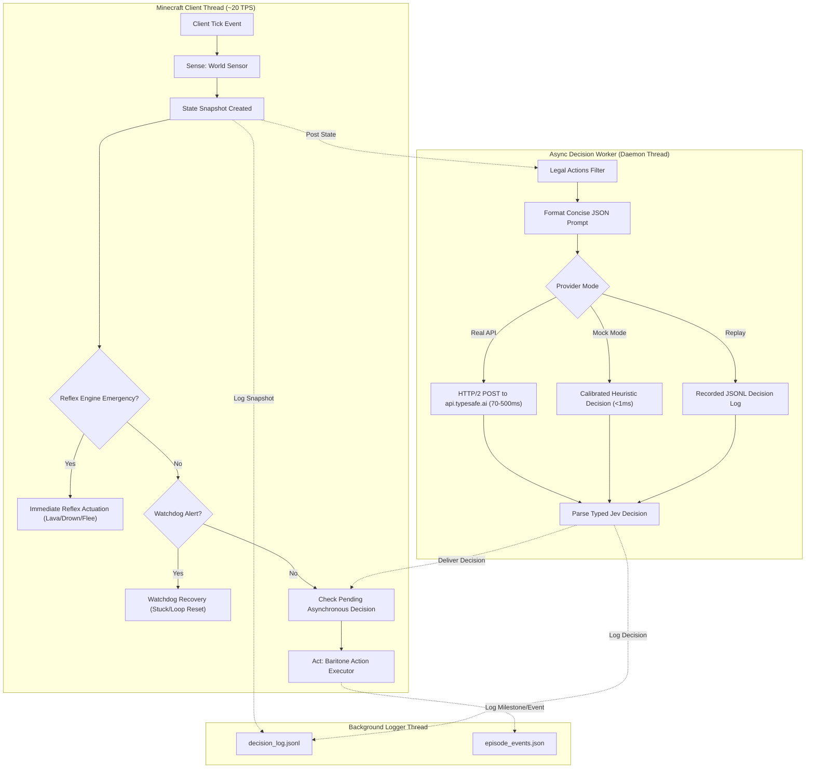
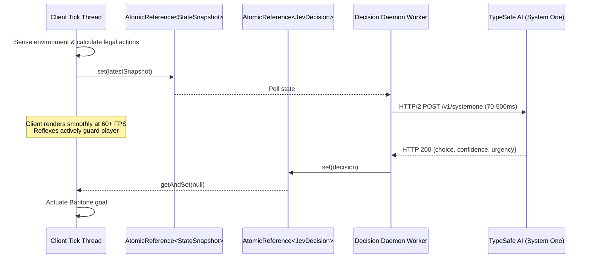
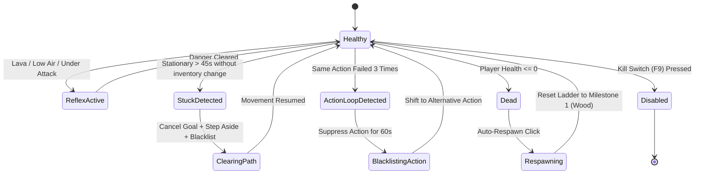

# JevPlayer Architecture Specification

**JevPlayer** is a client-side Fabric mod designed for autonomous Minecraft survival gameplay. It integrates **TypeSafe AI's Jev** (a fast, calibrated System-One decision engine) with **Baritone** (the industry-standard pathing and mining actuator) via a zero-allocation, modular architecture.

---

## 1. System Overview & Sense-Decide-Act Cycle

The core runtime operates on an asynchronous **Sense $\to$ Decide $\to$ Act** cycle designed to maintain client-thread responsiveness without dropping frames.



---

## 2. Multi-Module Project Structure

To decouple Minecraft dependencies and allow cross-version support, the repository is partitioned into a zero-dependency core module and thin versioned adapters:

```
JevPlays/
├── core/                           # Pure Java 21/25, ZERO Minecraft dependencies
│   ├── src/main/java/com/typesafe/jevplayer/core/
│   │   ├── action/                 # Action catalog (14 actions) & legal action generator
│   │   ├── bridge/                 # Abstract sensor & actuator bridge interfaces
│   │   ├── config/                 # Configuration model & secure key redaction
│   │   ├── decision/               # TypeSafe HTTP/2 client, MockProvider, DecisionReplay
│   │   ├── director/               # 9-stage milestone ladder & episode pacing
│   │   ├── reflex/                 # Zero-latency emergency reflexes (lava, air, combat)
│   │   ├── sim/                    # Headless simulated world adapter for unit tests
│   │   ├── state/                  # Zero-allocation state snapshots & hash generators
│   │   └── watchdog/               # Stuck detection, loop breaker, death watchdogs
│   └── src/test/java/              # 100% deterministic unit tests (JUnit 5)
├── adapter-1_21_11/                # Fabric Loom module for Minecraft 1.21.11
│   ├── src/main/java/.../          # Concrete WorldSensor, ActionExecutor, InputBridge, HUD
│   └── src/main/resources/         # fabric.mod.json for 1.21.11
├── adapter-26_1/                   # Thin adapter for Minecraft 26.1 (unobfuscated)
│   └── src/main/java/.../          # ClientModInitializer & Baritone 1.18.0 bridge
├── adapter-26_2/                   # Thin adapter for Minecraft 26.2 (unobfuscated)
│   └── src/main/java/.../          # ClientModInitializer & Baritone 1.19.0 bridge
└── libs/                           # Official Baritone public API jars
```

### Why Multi-Module?
1. **Deterministic Testing:** The `core` module compiles with pure Java and runs entire 10,000-tick simulations in headless unit tests without launching Minecraft or loading native libraries.
2. **Version Independence:** Changes to Minecraft versions (such as the un-obfuscated architecture in 26.x) do not require altering core decision logic, reflex trees, or watchdog rules.
3. **No Code Duplication:** Adapters remain thin shims (typically $< 300$ LOC) that map Minecraft entities, blocks, and keys to core POJOs.

---

## 3. Concurrency & Thread Synchronization

Minecraft runs rendering and client entity updates synchronously on the main thread. Network I/O or blocking waits on that thread cause immediate frame stutter.

### Lock-Free Reference Exchange


- **Thread Confinement:** State reading occurs only on the client thread.
- **Reference Passing:** The decision worker takes an immutable `StateSnapshot`.
- **Preemption:** If an emergency reflex fires while a network query is pending, the reflex takes precedence immediately. When the delayed HTTP response returns, the main thread discards it if the game state has transitioned.

---

## 4. Reflex Engine vs. System-One Jev

| Feature | Reflex Engine (System 0) | TypeSafe Jev (System 1) |
| :--- | :--- | :--- |
| **Execution Thread** | Client tick thread (synchronous) | Background daemon thread (asynchronous) |
| **Latency** | $< 0.05 \text{ ms}$ | $70 \text{ -- } 500 \text{ ms}$ |
| **Trigger Criteria** | Lava, drowning, fire, point-blank combat, starving | Strategic choices (mining, crafting, exploring, sleeping) |
| **Preemption Power** | Can cancel any active Baritone goal instantly | Subordinate to active reflexes and watchdogs |
| **Failure Mode** | Fail-safe: immediate protective action | Fail-soft: fallback to heuristic rule if confidence $< 0.65$ |

---

## 5. Actuation via Baritone (LGPL-3.0 Compliance)

JevPlayer never modifies, forks, or bundles Baritone source code. All actuation interfaces through `baritone.api.BaritoneAPI`:

- **Pathing:** `BaritoneAPI.getProvider().getPrimaryBaritone().getCustomGoalProcess().setGoalAndPath(new GoalBlock(pos))`
- **Mining:** `BaritoneAPI.getProvider().getPrimaryBaritone().getMineProcess().mineByName(blockName)`
- **Exploration:** `BaritoneAPI.getProvider().getPrimaryBaritone().getExploreProcess().explore(originX, originZ)`
- **Inventory/Crafting:** Executed via standard Minecraft `ClientPlayerInteractionManager` window click packets or Baritone builder process.

---

## 6. Watchdog & Failure Recovery Matrix


